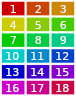
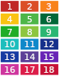

# Colors

## Cue Colors

The on-screen representation of hotcue colors can differ slightly from what's stored in the `Serato Markers2` tag depending on wether Serato DJ Pro, Serato DJ Lite or Serato DJ Intro is used.
In contrast to Serato DJ Intro which just displays the colors unchanged, both Serato DJ Lite and Serato DJ Pro apply some kind of transformation or colorscheme, so that the actual color of the hotcue and the color show in the GUI are not the same.

### Serato DJ Intro

Serato DJ Intro lets the user choose from a palette of 18 different colors.

This is the only Serato variant that displays the colors exactly like they are saved (i.e. without applying any transformation/colorscheme).

|  # | Hot Cue | Saved                                                              | Displayed                                                          |
| -- | ------- | ------------------------------------------------------------------ | ------------------------------------------------------------------ |
|  1 |       1 |  `#CC0000` |  `#CC0000` |
|  2 |         |  `#CC4400` |  `#CC4400` |
|  3 |       2 |  `#CC8800` |  `#CC8800` |
|  4 |       4 |  `#CCCC00` |  `#CCCC00` |
|  5 |         |  `#88CC00` |  `#88CC00` |
|  6 |         |  `#44CC00` |  `#44CC00` |
|  7 |       5 |  `#00CC00` |  `#00CC00` |
|  8 |         |  `#00CC44` |  `#00CC44` |
|  9 |         |  `#00CC88` |  `#00CC88` |
| 10 |         |  `#00CCCC` |  `#00CCCC` |
| 11 |         |  `#0088CC` |  `#0088CC` |
| 12 |         |  `#0044CC` |  `#0044CC` |
| 13 |       3 |  `#0000CC` |  `#0000CC` |
| 14 |         |  `#4400CC` |  `#4400CC` |
| 15 |         |  `#8800CC` |  `#8800CC` |
| 16 |         |  `#CC00CC` |  `#CC00CC` |
| 17 |         |  `#CC0088` |  `#CC0088` |
| 18 |         |  `#CC0044` |  `#CC0044` |

### Serato DJ Lite

Serato DJ Lite only has 4 hotcues with predefined, unchangeable colors.

Like Serato DJ Pro, the Lite version has a slight difference between saved and displayed colors (see below).

|  # | Hot Cue | Saved                                                              | Displayed                                                          |
| -- | ------- | ------------------------------------------------------------------ | ------------------------------------------------------------------ |
|  1 |       1 |  `#CC0000` |  `#C02626` |
|  2 |       2 |  `#CC8800` |  `#F8821A` |
|  3 |       3 |  `#0000CC` |  `#173BA2` |
|  4 |       4 |  `#CCCC00` |  `#FAC313` |

### Serato DJ Pro

Serato DJ Pro's color picker features 18 different colors:

In contrast to Serato DJ Intro, the saved and displayed colors are slightly different, probably to be a better match for the GUI's colorscheme.

|  # | Hot Cue | Saved                                                              | Displayed                                                          |
| -- | ------- | ------------------------------------------------------------------ | ------------------------------------------------------------------ |
|  1 |       1 |  `#CC0000` |  `#C02626` |
|  2 |         |  `#CC4400` |  `#DB4E27` |
|  3 |       2 |  `#CC8800` |  `#F8821A` |
|  4 |       4 |  `#CCCC00` |  `#FAC313` |
|  5 |         |  `#88CC00` |  `#4EB648` |
|  6 |         |  `#44CC00` |  `#006838` |
|  7 |       5 |  `#00CC00` |  `#1FAD26` |
|  8 |         |  `#00CC44` |  `#8DC63F` |
|  9 |         |  `#00CC88` |  `#2B3673` |
| 10 |       7 |  `#00CCCC` |  `#1DBEBD` |
| 11 |         |  `#0088CC` |  `#0F88CA` |
| 12 |         |  `#0044CC` |  `#16308B` |
| 13 |       3 |  `#0000CC` |  `#173BA2` |
| 14 |         |  `#4400CC` |  `#5C3F97` |
| 15 |       8 |  `#8800CC` |  `#6823B6` |
| 16 |       6 |  `#CC00CC` |  `#CE359E` |
| 17 |         |  `#CC0088` |  `#DC1D49` |
| 18 |         |  `#CC0044` |  `#C71136` |

## Track Colors

Serato DJ Pro displays different colors in the color picker and the actual column (see table below).
Generally, the column value can be calculated by substracting `0x666666` from the stored value. If the result is less than 0, `0x1000000` is also added.
An alternative way to calculate is without using signed numbers: If the stored value is less than `0x666666` then add `0x99999A`, else substract `0x666666`

There are some exceptions though:
- If the stored color is `0x999999`, `0x090909` will be displayed instead of `0x333333` (this means that both `0x999999` and `0x6F6F6F` will result in the same color)
- If the stored color is `0xFFFFFF`, `0x333333` will be displayed instead of `0x999999`
- If the stored color is `0x000000`, `0x333333` will be displayed instead of `0x99999a`

This means that both `0x999999` and `0x999999a` cannot be used in the track color library column.

|  # | Color Picker / Stored in Tag                                       | Shown in Library Column
| -- | ------------------------------------------------------------------ | ------------------------------------------------------------------
|  1 |  `#FF99FF` |  `#993399`
|  2 |  `#FF99DD` |  `#993377`
|  3 |  `#FF99BB` |  `#993355`
|  4 |  `#FF9999` |  `#993333`
|  5 |  `#FFBB99` |  `#995533`
|  6 |  `#FFDD99` |  `#997733`
|  7 |  `#FFFF99` |  `#999933`
|  8 |  `#DDFF99` |  `#779933`
|  9 |  `#BBFF99` |  `#559933`
| 10 |  `#99FF99` |  `#339933`
| 11 |  `#99FFBB` |  `#339955`
| 12 |  `#99FFDD` |  `#339977`
| 13 |  `#99FFFF` |  `#339999`
| 14 |  `#99DDFF` |  `#337799`
| 15 |  `#99BBFF` |  `#335599`
| 16 |  `#9999FF` |  `#333399`
| 17 |  `#BB99FF` |  `#553399`
| 18 |  `#DD99FF` |  `#773399`
| 19 |  `#FFFFFF` |  `#333333`
| 20 |  `#BBBBBB` |  `#555555`
| 21 |  `#999999` |  `#090909`
