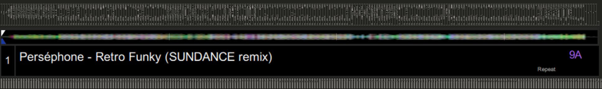

# Serato Overview

Contains the waveform overview data.

| Offset | Length | Raw Value                 | Decoded Value | Type                    | Description
| ------ | ------ | ------------------------- | ------------- | ----------------------- | -----------
|   `00` |   `02` | `01 05`                   |               |                         |
|   `02` |   `10` | `01` ... `01`             |               | 16 * `uint8_t`          | Freqency information
|    ... |    ... | `01` ... `01`             |               | 16 * `uint8_t`          | Freqency information
|  `ef2` |   `10` | `01` ... `01`             |               | 16 * `uint8_t`          | Freqency information

