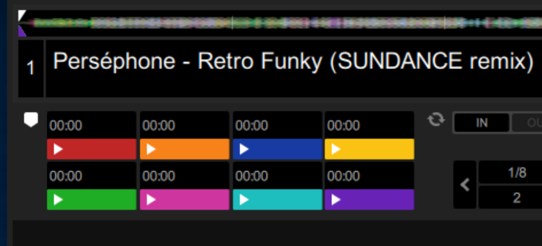
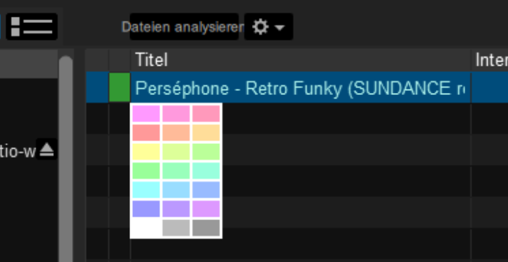

# Reversing Serato's GEOB tags

**This a mirror of the writeup that I [published on my blog](https://homepage.ruhr-uni-bochum.de/jan.holthuis/posts/reversing-seratos-geob-tags).**

The popular DJ application *Serato DJ Pro* stores a lot data in GEOB-type ID3 tags of MP3 files.
This way, users can share beatgrids, hot cue points, saved loops and more by just copying over an MP3 file.

Unfortunately, the format is not [publicly](https://serato.com/forum/discussion/1277101) [documented](https://music.stackexchange.com/questions/53753/documentation-for-the-embedded-cue-point-format-of-traktor-serato-ableton).
Thus, I figured it could be fun to try to learn how these formats work *the hard way(tm)*.

## Setup and Preparation

As example file I used [Perséphone - Retro Funky (SUNDANCE remix)](https://soundcloud.com/sundancemusic/pers-phone-retro-funky), which is licensed under the term of the [Creative Commons Attribution 3.0 Unported (CC BY 3.0) license](https://creativecommons.org/licenses/by/3.0/).

    $ lame -b 320 Perséphone\ -\ Retro\ Funky\ \(SUNDANCE\ remix\).wav
    LAME 3.100 64bits (http://lame.sf.net)
    Using polyphase lowpass filter, transition band: 20094 Hz - 20627 Hz
    Encoding Perséphone - Retro Funky (SUNDANCE remix).wav
        to Perséphone - Retro Funky (SUNDANCE remix).mp3
    Encoding as 44.1 kHz j-stereo MPEG-1 Layer III (4.4x) 320 kbps qval=3
        Frame          |  CPU time/estim | REAL time/estim | play/CPU |    ETA
    8170/8170  (100%)|    0:03/    0:03|    0:03/    0:03|   68.457x|    0:00
    -----------------------------------------------------------------------------------------------------------------------------------------------------------------------------------------------------------------
    kbps        LR    MS  %     long switch short %
    320.0       99.1   0.9        87.8   6.3   5.8
    Writing LAME Tag...done
    ReplayGain: -10.6dB

Initially, there are no tags in the resulting MP3 file:

    $ eyeD3 -v original.mp3
    .../original.mp3 [ 8.14 MB ]
    -------------------------------------------------------------------------------
    Time: 03:33	MPEG1, Layer III	[ 320 kb/s @ 44100 Hz - Joint stereo ]
    -------------------------------------------------------------------------------
    No ID3 v1.x/v2.x tag found!

Next, I'm starting up a Windows 10 VM with Serato DJ Pro 2.1.1 installed.
For some reason Serato causes my CPU usage to go up to 100%, but that can be ignored since we're not doing anything latency-critical.

To make testing easier, I'll just put the MP3 file into a separate directory on my host system and create a Samba network share to access it from inside the VM.
Serato does not list network shares in the sidebar, but it's still possible to load tracks from network shares into a deck directly by using drag and drop from a file explorer window.

First, let's just load the tack into deck 1, wait until Serato is done with analyzing it and then ejecting it to make sure that ID3 tag changes are written to the file.

We can see that the file has indeed changed by comparing it to the original file:

    $ sha1sum original.mp3 analyzed.mp3
    521974eb217ef001e6df426d1e2908cd80c39b6b  original.mp3
    46e7f16f735758b4d85730b639c908850860537b  analyzed.mp3

    $ eyeD3 -v analyzed.mp3
    eyed3.id3.frames:WARNING: Frame 'RVAD' is not yet supported, using raw Frame to parse
    .../analyzed.mp3                 [ 8.16 MB ]
    -------------------------------------------------------------------------------
    Time: 03:33	MPEG1, Layer III	[ 320 kb/s @ 44100 Hz - Joint stereo ]
    -------------------------------------------------------------------------------
    ID3 v2.3:
    title: Perséphone - Retro Funky (SUNDANCE remix)
    artist:
    album:
    album artist: None
    track:
    BPM: 115
    GEOB: [Size: 3842 bytes] [Type: application/octet-stream]
    Description: Serato Overview
    Filename:

    GEOB: [Size: 2 bytes] [Type: application/octet-stream]
    Description: Serato Analysis
    Filename:

    GEOB: [Size: 22 bytes] [Type: application/octet-stream]
    Description: Serato Autotags
    Filename:

    GEOB: [Size: 318 bytes] [Type: application/octet-stream]
    Description: Serato Markers_
    Filename:

    GEOB: [Size: 470 bytes] [Type: application/octet-stream]
    Description: Serato Markers2
    Filename:

    GEOB: [Size: 15 bytes] [Type: application/octet-stream]
    Description: Serato BeatGrid
    Filename:

    GEOB: [Size: 16401 bytes] [Type: application/octet-stream]
    Description: Serato Offsets_
    Filename:

    -------------------------------------------------------------------------------
    6 ID3 Frames:
    TIT2 (52 bytes)
    TCON (11 bytes)
    TKEY (13 bytes)
    RVAD (20 bytes)
    TBPM (14 bytes)
    GEOB x 7 (21441 bytes)
    512 bytes unused (padding)
    -------------------------------------------------------------------------------

The `GEOB` tags look interesting, so let's dump them to individual files for further analysis:

    $ eyeD3 --write-objects analyzed analyzed.mp3
    eyed3.id3.frames:WARNING: Frame 'RVAD' is not yet supported, using raw Frame to parse
    .../analyzed.mp3                 [ 8.16 MB ]
    -------------------------------------------------------------------------------
    Time: 03:33	MPEG1, Layer III	[ 320 kb/s @ 44100 Hz - Joint stereo ]
    -------------------------------------------------------------------------------
    ID3 v2.3:
    title: Perséphone - Retro Funky (SUNDANCE remix)
    artist:
    album:
    album artist: None
    track:
    BPM: 115
    GEOB: [Size: 3842 bytes] [Type: application/octet-stream]
    Description: Serato Overview
    Filename:

    Writing analyzed/Serato Overview.octet-stream...
    GEOB: [Size: 2 bytes] [Type: application/octet-stream]
    Description: Serato Analysis
    Filename:

    Writing analyzed/Serato Analysis.octet-stream...
    GEOB: [Size: 22 bytes] [Type: application/octet-stream]
    Description: Serato Autotags
    Filename:

    Writing analyzed/Serato Autotags.octet-stream...
    GEOB: [Size: 318 bytes] [Type: application/octet-stream]
    Description: Serato Markers_
    Filename:

    Writing analyzed/Serato Markers_.octet-stream...
    GEOB: [Size: 470 bytes] [Type: application/octet-stream]
    Description: Serato Markers2
    Filename:

    Writing analyzed/Serato Markers2.octet-stream...
    GEOB: [Size: 15 bytes] [Type: application/octet-stream]
    Description: Serato BeatGrid
    Filename:

    Writing analyzed/Serato BeatGrid.octet-stream...
    GEOB: [Size: 16401 bytes] [Type: application/octet-stream]
    Description: Serato Offsets_
    Filename:

    Writing analyzed/Serato Offsets_.octet-stream...
    -------------------------------------------------------------------------------

## A first look

Now let's have a look at the tag data and see if we can determine the meaning of it.
The `Serato Analysis` tag only contains 2 bytes, so let's look at that one first.

    $ hexdump -C analyzed/Serato\ Analysis.octet-stream
    00000000  02 01                                             |..|
    00000002

It's just a suspicion, but the numbers `02 01` look like the major/minor part of the version number of Serato that was used for analysis (2.1.1).

The hexdump of next larger tag (in terms of byte length), `Serato BeatGrid`, is inconclusive at the moment, but `Serato Autotags` contains recognizable data:

    $ hexdump -C analyzed/Serato\ Autotags.octet-stream
    00000000  01 01 31 31 35 2e 30 30  00 2d 33 2e 32 35 37 00  |..115.00.-3.257.|
    00000010  30 2e 30 30 30 00                                 |0.000.|
    00000016

We can easily see that the tag contains the string `115.00`, which is also the BPM value that is displayed by Serato.
There are two more ASCII strings in there, but I'm not sure what they are for.

Next, let's have a look at hexdump of `Serato Markers2`:

    $ hexdump -C analyzed/Serato\ Markers2.octet-stream
    00000000  01 01 41 51 46 44 54 30  78 50 55 67 41 41 41 41  |..AQFDT0xPUgAAAA|
    00000010  41 45 41 50 2f 2f 2f 30  4a 51 54 55 78 50 51 30  |AEAP///0JQTUxPQ0|
    00000020  73 41 41 41 41 41 41 51  41 41 00 00 00 00 00 00  |sAAAAAAQAA......|
    00000030  00 00 00 00 00 00 00 00  00 00 00 00 00 00 00 00  |................|
    *
    000001d0  00 00 00 00 00 00                                 |......|
    000001d6

The ASCII data in that file certainly looks like it has been base64-encoded.
Let's verify that that assumption and see what's inside:

    $ grep -Poaz '[\w/]*' analyzed/Serato\ Markers2.octet-stream | tr -d '\0' | base64 -d | hexdump -C
    00000000  01 01 43 4f 4c 4f 52 00  00 00 00 04 00 ff ff ff  |..COLOR.........|
    00000010  42 50 4d 4c 4f 43 4b 00  00 00 00 01 00 00        |BPMLOCK.......|
    0000001e

The `Serato Overview` tag is almost 4 KB in size. The ASCII representation that is generated by hexdump -C looks quite familiar:

This tag obviously contains the data for the track overview in Serato.

The remaining tags, `Serato Markers_` and `Serato Offsets_` contain a lot of repeating data, but it's uncertain what it means.

# Looking for changes

Now, let's take our analyzed file and set a hot cue point.
Again, we eject afterwards and use `eyeD3` to write the data inside the ID3 GEOB tags to a directory:

    $ mkdir hotcue-00m00s0-red
    $ eyeD3 --write-objects hotcue-00m00s0-red hotcue-00m00s0-red.mp3
    <output removed>
    $ cd hotcue-00m00s0-red

Next, let's check if anything changed:

    $ for file in *.octet-stream; do diff -q "$file" "../analyzed/$file"; done
    Files Serato Markers2.octet-stream and ../analyzed/Serato Markers2.octet-stream differ
    Files Serato Markers_.octet-stream and ../analyzed/Serato Markers_.octet-stream differ

Both `Serato Markers_` and `Serato Markers2` have been modified.

Let's look at `Serato Markers2` first.
Before setting the cue point, that file just contained base64-encoded data and some zero bytes.
This is still the case, but the base64-encoded data has grown in size:

    $ hexdump -C Serato\ Markers2.octet-stream
    00000000  01 01 41 51 46 44 54 30  78 50 55 67 41 41 41 41  |..AQFDT0xPUgAAAA|
    00000010  41 45 41 50 2f 2f 2f 30  4e 56 52 51 41 41 41 41  |AEAP///0NVRQAAAA|
    00000020  41 4e 41 41 41 41 41 41  41 41 41 4d 77 41 41 41  |ANAAAAAAAAAMwAAA|
    00000030  41 41 41 45 4a 51 54 55  78 50 51 30 73 41 41 41  |AAAEJQTUxPQ0sAAA|
    00000040  41 41 41 51 41 41 00 00  00 00 00 00 00 00 00 00  |AAAQAA..........|
    00000050  00 00 00 00 00 00 00 00  00 00 00 00 00 00 00 00  |................|
    *
    000001d0  00 00 00 00 00 00                                 |......|
    000001d6

    $ grep -Poaz '[\w/]*' Serato\ Markers2.octet-stream | tr -d '\0' | base64 -d | hexdump -C
    00000000  01 01 43 4f 4c 4f 52 00  00 00 00 04 00 ff ff ff  |..COLOR.........|
    00000010  43 55 45 00 00 00 00 0d  00 00 00 00 00 00 00 cc  |CUE.............|
    00000020  00 00 00 00 00 42 50 4d  4c 4f 43 4b 00 00 00 00  |.....BPMLOCK....|
    00000030  01 00 00                                          |...|
    00000033

When we compare it with the previous content, we can see that these 21 bytes have been added:

    $ grep -Poaz '[\w/]*' Serato\ Markers2.octet-stream | tr -d '\0' | base64 -d | tail -c +17 | head -c -14 | hexdump -C
    00000000  43 55 45 00 00 00 00 0d  00 00 00 00 00 00 00 cc  |CUE.............|
    00000010  00 00 00 00 00                                    |.....|
    00000015

Except for the first 3 bytes that say `CUE` in ASCII, we don't really know what these values mean though.

To determine what the individual bytes mean, we can change something and check how these are represented in the ID3 tags.
For example, when the cue color is changed to blue, the content of the base64-encoded data changes as well:

    $ grep -Poaz '[\w/]*' hotcue-00m00s0-red/Serato\ Markers2.octet-stream | tr -d '\0' | base64 -d | tail -c +17 | head -c -14 | hexdump -e '"%08.8_ax " 21/1 "%02X " "\n"'
    00000000 43 55 45 00 00 00 00 0d 00 00 00 00 00 00 00 cc 00 00 00 00 00
    $ grep -Poaz '[\w/]*' hotcue-00m00s0-bue/Serato\ Markers2.octet-stream | tr -d '\0' | base64 -d | tail -c +17 | head -c -14 | hexdump -e '"%08.8_ax " 21/1 "%02X " "\n"'
    00000000 43 55 45 00 00 00 00 0d 00 00 00 00 00 00 00 00 00 cc 00 00 00

As we can see, the `cc` byte has moved two bytes to the right, i.e. `cc 00 00` became `00 00 cc`.
If that 3-byte value is interpreted as RGB channel values, `cc 00 00` is indeed red and `00 00 cc` is blue.

Next, we compare it with a file that 8 cuepoints in different colors.

The data looks like this:

    $ grep -Poaz '[\w/]*' hotcue-colors/Serato\ Markers2.octet-stream | tr -d '\0' | base64 -d | tail -c +17 | head -c -14 | hexdump -e '"%08.8_ax " 21/1 "%02X " "\n"'
    00000000 43 55 45 00 00 00 00 0d 00 00 00 00 00 00 00 cc 00 00 00 00 00
    00000015 43 55 45 00 00 00 00 0d 00 01 00 00 00 00 00 cc 88 00 00 00 00
    0000002a 43 55 45 00 00 00 00 0d 00 02 00 00 00 00 00 00 00 cc 00 00 00
    0000003f 43 55 45 00 00 00 00 0d 00 03 00 00 00 00 00 cc cc 00 00 00 00
    00000054 43 55 45 00 00 00 00 0d 00 04 00 00 00 00 00 00 cc 00 00 00 00
    00000069 43 55 45 00 00 00 00 0d 00 05 00 00 00 00 00 cc 00 cc 00 00 00
    0000007e 43 55 45 00 00 00 00 0d 00 06 00 00 00 00 00 00 cc cc 00 00 00
    00000093 43 55 45 00 00 00 00 0d 00 07 00 00 00 00 00 88 00 cc 00 00 00

As we would expect, there are 8 different entries with 8 different values at the position the color could be stored.

Using `gpick`, we check if the colors actually match:

Bingo! These colors look a lot like those displayed in Serato.
However, the colors displayed in Serato are slightly different.
When using a color picker tool (e.g. `gpick`), we can see that the red displayed in the UI is in fact `#c02626`:

However, since the colors and their indices match so well, this can't really be coincidence.
It suppose there's some kind of color scheme or transformation applied to these values.

## Diving deeper into the `Serato Markers2` internals

Since color information seem to be easily recognizable, we can use this to check if tracklist colors are stored in the `Serato Markers2` tag as well.
Hence, let's the tracklist color to green:

    $ grep -Poaz '[\w/]*' tracklist-color/Serato\ Markers2.octet-stream | tr -d '\0' | base64 -d | hexdump -C
    00000000  01 01 43 4f 4c 4f 52 00  00 00 00 04 00 99 ff 99  |..COLOR.........|
    00000010  42 50 4d 4c 4f 43 4b 00  00 00 00 01 00 00        |BPMLOCK.......|
    0000001e

Since the color `#99FF99` is green, the bytes `99 ff 99` seem to be RGB channel values for the track color.

It makes sense to recapture our findings regarding the `Serato Markers2` tag and see if we can see a pattern:

    1. The base64-content starts with `01 01`...
    2. ... followed by multiple entries, where:
        1. Each entry starts with a zero-terminated ASCII string denoting the entry type.
        2. `COLOR` entries contain 8 more bytes.
        3. `CUE` entries contain 17 more bytes.
        4. `BPMLOCK` entries contain 6 more bytes.

How would Serato parse this data?
Each entry has a different size, even when we leave out the zero-terminated entry type.
While it might be possible that Serato has a built-in mapping of entry types and their lengths, this would make it impossible to add new entry types in a backward-compatible way.
Older versions would have no way to determine the length and thus can't skip the entry because they do not know where the next entry starts.

Let's look closer at the first few bytes of each entry:

    1. `COLOR` entries contain 8 bytes and start with `00 00 00 04`.
    2. `CUE` entries contain 17 bytes and start with `00 00 00 0d`.
    3. `BPMLOCK` entries contain 6 bytes and start with `00 00 00 01`.

If we parse the first 4 bytes as 32-bit integer (little-endian), we can reasonably assume that determine the entry's length (excluding the integer itself).
But wait, this doesn't work for `BPMLOCK` entries since they contain 2 more bytes, even though according to the length value there should only be 1 byte.

Does this mean that our assumption is wrong?

No, not neccessarily:
Since `BPMLOCK` is the last entry inside the base64-encoded data, it's possible that the last byte (`00`) doesn't actually belong to the `BPMLOCK` entry.
Instead it could be a sentinel value to tell Serato to stop parsing entries.

## Hotcue positions

Now it's time to decode the hotcue positions.
To archieve this, I created a 5 hotcues with (hopefully) recognizable positions:

| Hotcue | Position  | Comment
| ------ | --------- | -------
|      1 | `00:00.0` | Start of the file
|      2 | `03:38.4` | End of the file
|      3 | `01:00.0` |
|      4 | `00:00.1` |
|      5 | `00:01.0` |

Looking at the hexdump, it is apparent that the 5 bytes between the hotcue index and the color contains the position:

    $ grep -Poaz '[\w/]*' hotcue-positions-00m00s0-03m38s4-01m00s0-00m00s1-00m01s0/Serato\ Markers2.octet-stream | tr -d '\0' | base64 -d | tail -c +17 | head -c -14 | hexdump -e '"%08.8_ax " 21/1 "%02x " "\n"'
    00000000 43 55 45 00 00 00 00 0d 00 00 00 00 00 00 00 cc 00 00 00 00 00
    00000015 43 55 45 00 00 00 00 0d 00 01 00 03 55 58 00 cc 88 00 00 00 00
    0000002a 43 55 45 00 00 00 00 0d 00 02 00 00 ea 64 00 00 00 cc 00 00 00
    0000003f 43 55 45 00 00 00 00 0d 00 03 00 00 00 6c 00 cc cc 00 00 00 00
    00000054 43 55 45 00 00 00 00 0d 00 04 00 00 03 f7 00 00 cc 00 00 00 00

It is likely that the position will be some kind of `int` or `float` value.
Since we already found little-endian values, the value will probably have little-endian byte order as well.

Since both types are only 4 bytes long, we do not know which bytes belongs to another field.
However, we can easily check all possibilities and see if we recognize something:

    $ python
    Python 3.7.3 (default, Jun 24 2019, 04:54:02)
    [GCC 9.1.0] on linux
    Type "help", "copyright", "credits" or "license" for more information.
    >>> data = [
    ... '00 00 00 00 00',
    ... '00 03 55 58 00',
    ... '00 00 ea 64 00',
    ... '00 00 00 6c 00',
    ... '00 00 03 f7 00',
    ... ]
    >>> import binascii
    >>> x = [binascii.unhexlify(x.replace(' ','')) for x in data]
    >>> x
    [b'\x00\x00\x00\x00\x00', b'\x00\x03UX\x00', b'\x00\x00\xead\x00', b'\x00\x00\x00l\x00', b'\x00\x00\x03\xf7\x00']
    >>> bindata = [binascii.unhexlify(x.replace(' ','')) for x in data]
    >>> import struct
    >>> for x in bindata:
    ...     print('%10d %10d %3.10e %3.10e' % (struct.unpack('>xI', x)[0], struct.unpack('>Ix', x)[0], struct.unpack('>xf', x)[0], struct.unpack('>fx', x)[0]))
    ...
             0          0 0.0000000000e+00 0.0000000000e+00
      55924736     218456 6.2696093227e-37 3.0612205732e-40
      15361024      60004 2.1525379342e-38 8.4083513053e-41
         27648        108 3.8743099942e-41 1.5134023415e-43
        259840       1015 3.6411339297e-40 1.4223179413e-42

Now let's look at the results while keeping in mind that:
- Hotcue 2 has been placed at 03:38.4 = 218.4 seconds = 218400 milliseconds
- Hotcue 3 has been placed at 1 minute = 60 seconds = 60000 milliseconds.
- Hotcue 4 has been placed at 0.1 seconds = 100 milliseconds.
- Hotcue 5 has been placed at 1 second = 1000 milliseconds.

Column 2 is obviously containing the values we're looking for.
This means that the 4 bytes following the hotcue index value contain the position in milliseconds as little-endian integer.

## What's your name?

Since it's also possible to assign textual names to hot cue points in Serato, let's check how these are stored.
After preparing a file with 3 named hotcues and dumping its tags, a quick glance at `hexdump`'s output confirms that the names are also stored in `Serato Markers2`.

    $ grep -Poaz '[\w/]*' hotcues-with-names/Serato\ Markers2.octet-stream | tr -d '\0' | base64 -d | hexdump -C
    00000000  01 01 43 4f 4c 4f 52 00  00 00 00 04 00 ff ff ff  |..COLOR.........|
    00000010  43 55 45 00 00 00 00 1a  00 00 00 00 00 00 00 cc  |CUE.............|
    00000020  00 00 00 00 48 65 6c 6c  6f 2c 20 57 6f 72 6c 64  |....Hello, World|
    00000030  21 00 43 55 45 00 00 00  00 15 00 01 00 03 55 58  |!.CUE.........UX|
    00000040  00 cc 88 00 00 00 c3 a4  c3 b6 c3 bc c3 9f 00 43  |...............C|
    00000050  55 45 00 00 00 00 13 00  02 00 00 ea 64 00 00 00  |UE..........d...|
    00000060  cc 00 00 c3 a9 c3 a8 c3  aa 00 42 50 4d 4c 4f 43  |..........BPMLOC|
    00000070  4b 00 00 00 00 01 00 00                           |K.......|
    00000078

As we can see in `hexdump`'s ASCII output, the first hotcue is named `Hello, World!`.
To check how non-ASCII chars in hotcue names are encoded, hotcue 2 and 3 were named `äöüß` and `éèê`.
My guess that `UTF-8` has been used turned out to be correct.

## Saved Loops

Using the same approach as above can be used to determine how saved loops are stored.
One problem  popped up is that Serato may insert linefeed characters `0a` into the base64 string.

Also, the base64 string may lead to decoding errors caused by an invalid length.
In that case the last byte can apparently just be ignored.

## What's left to do?

A lot. Some fields in the `Serato Markers2` are still unmapped, and I didn't really look at the `Serato Offsets_` and `Serato_Markers_` tags.
Maybe some fields could be edited manually to see how Serato reacts to these changes?

I was mainly doing this to add support for importing Serato Hotcues to [Mixxx](https://www.mixxx.org/), an excellent free and open-source DJ application that runs on Windows, Mac and Windows.
Also, I didn't investigate how [Serato Flips](https://store.serato.com/us/software/expansion-packs/serato-dj-flip-expansion-pack) are stored [since such a functionality is not implemented in Mixxx yet](https://bugs.launchpad.net/mixxx/+bug/1768113).

If you want to help completing the documentation of Serato's GEOB data formats, feel free to send me a pull request.
